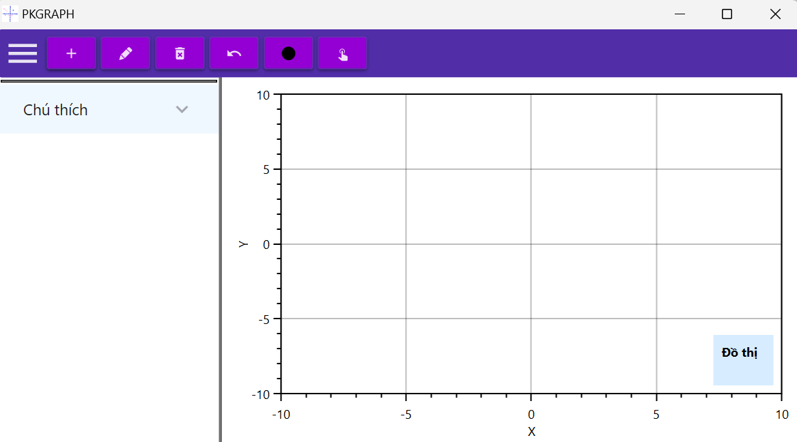
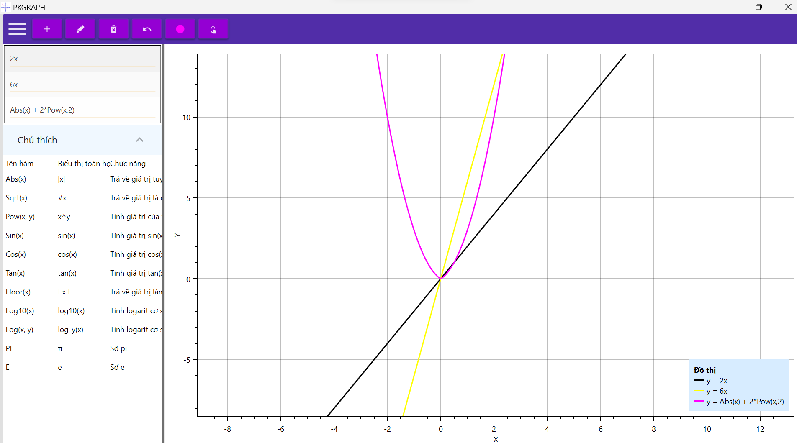
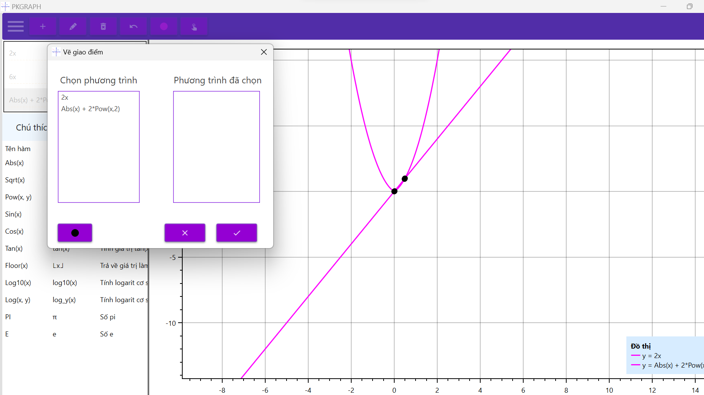
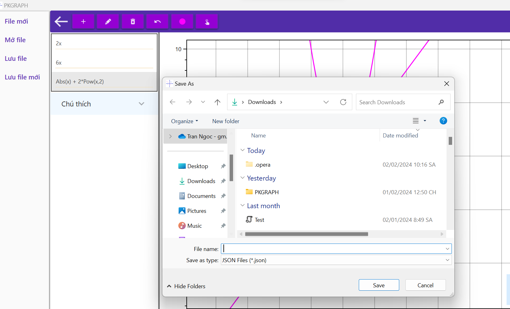

# PKGRAPH
This is the interface of the application. 

The graph drawing area supports zooming in and out with the mouse scroll wheel and dragging to different areas while holding down the right mouse button. When you click on the graph, it will display the pressed point and the graph containing it. You can easily draw multiple graphs and delete them, as well as customize their colors. You can find out the supported mathematical functions by clicking on the legend(Chú thích).
 

 

 
This application also supports drawing intersections of graphs.

When you click the toggle button, a drawer will appear. You can open a new window(File mới), open an existing file(Mở file), save the current file(Lưu file), or save a new file based on the current one(Lưu file mới).

